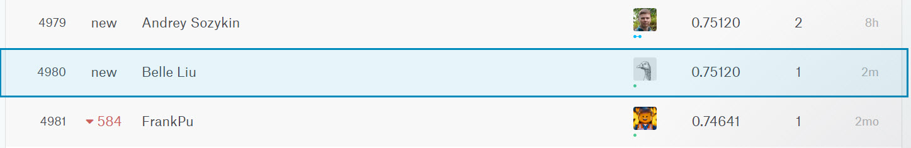

```{r setup, include=FALSE}
knitr::opts_chunk$set(echo = TRUE)
```

> ## Step 1. 讀取 Titanic 訓練資料

```{r }
  titanic <- read.csv("https://storage.googleapis.com/r_rookies/kaggle_titanic_train.csv")
```

> ####    1.1. Titanic 資料框外觀
              Titanic資料共有12個變數，891筆觀測值

```{r echo=FALSE}
  str(titanic)
```

> ####    1.2. Titanic 描述性統計
              在資料集裡，Age有177缺值、Embarked 有2個空值，這二個變數之遺漏值將會進一步處理，另外，Cabin雖然也有687筆空值，因為在這個案例裡，艙別被排除在影響因子之外，故其缺值估且忽略

```{r echo=FALSE}
  summary(titanic)
```

> ####    1.3. Titanic 缺失數據處理
              利用 VIM 套件可以使用 aggr() 函式圖示化缺失值狀態

```{r message=FALSE}
  library("VIM")
  aggr(titanic, col=c("deepskyblue","firebrick1"), numbers=TRUE, sortVars=TRUE ,
       labels=names(titanic), cex.axis=.7, gap=3,
       ylab=c("Proportion of missingness","Missingness Pattern"))
```

> ####  1.3.1. 利用 DMwR 套件的 k-Nearest Neighbours(KNN) 填補 Age 的缺值
             KNN 演算法是找一個和缺值最相似的資料，作為缺值的參考

```{r message=FALSE}
  library("DMwR")
  imputeData <- knnImputation(titanic)
  imputeData$Survived <- factor(imputeData$Survived)
```

> ####  1.3.2. 以S填補Embarked的空值

```{r}
  imputeData$Embarked <- as.character(imputeData$Embarked)
  imputeData$Embarked[imputeData$Embarked == ""] <- "S"
  imputeData$Embarked <- factor(imputeData$Embarked)
```

> ## Step 2. 探索性分析
            利用 ggplot2 與 plotly 套件先對資料進行觀察

```{r message=FALSE}
  library(ggplot2)
  library(plotly)
```

> ### 2.1. 盒鬚圖
          觀察性別之間的存活與年齡的關係

```{r message=FALSE}
  gg1 <- ggplot(imputeData, aes(x=Survived,y=Age)) +
  geom_boxplot(aes( fill = Survived)) +
  ggtitle(label ="Survived V.S. Age By Sex") +
  xlab("Survived") +
  ylab("Age") +
  scale_fill_manual(values=c("deepskyblue", "firebrick1")) +
  facet_wrap(~ Sex)
  ggplotly(gg1)
```


> ### 2.2. 長條圖
      觀察各種等級的性別與存活的狀態比列
```{r message=FALSE}
    gg2 <- ggplot(imputeData, aes(x=Sex)) +
    geom_bar(aes(fill = Survived), position = "dodge") +
    ggtitle(label ="Survived V.S. Sex By Pclass") +
    xlab("Pclass") +
    ylab("Count") +
    scale_fill_manual(values=c("deepskyblue", "firebrick1")) +
    facet_wrap(~ Pclass)
    ggplotly(gg2)
```

> ## Step 3. 建立模型分類
            利用 rpart 與 randomForest 套件建立分類模型來預測 Survived 變數，再以正確率較高的較模型進行模型測試
```{r message=FALSE}
  library(rpart)
  library(randomForest)
```
            
> #### 3.1. 使用 70/30 比例分割資料為訓練/測試樣本，訓練樣本共 624 筆，測試樣本共 267 筆
      
```{r message=FALSE}
  n <- nrow(imputeData)
  set.seed(87)
  shuffled_titanic <- imputeData[sample(n), ]
  train_indices <- 1:round(0.7 * n)
  train <- shuffled_titanic[train_indices, ]
  test_indices <- (round(0.7 * n) + 1):n
  test <- shuffled_titanic[test_indices, ]
```

> #### 3.2. 利用 rpart() 函數建立決策樹分類模型來預測 Survived 變數

```{r message=FALSE}
  tree_fit <- rpart(Survived ~ Pclass + Sex + Age + SibSp+ Parch + Fare + Embarked ,
                    data = train, method = "class")
  prediction <- predict(tree_fit, 
                        newdata=test[, c("Pclass", "Sex", "Age", "SibSp", "Parch", "Fare", "Embarked")], 
                        type = "class")   
  confusion_matrix <- table(test$Survived, prediction)
  confusion_matrix
  accuracy <- sum(diag(confusion_matrix)) / sum(confusion_matrix)
  accuracy
```

> #### 3.3. 利用 randomForest() 函數建立隨機森林分類模型來預測 Survived 變數

```{r message=FALSE}
forest_fit <- randomForest(Survived ~ Pclass + Sex + Age + SibSp + Parch + Fare + Embarked, 
                           data = train, ntree = 500)
prediction <- predict(forest_fit, 
                      newdata = test[, c("Pclass", "Sex", "Age", "SibSp", "Parch", "Fare", "Embarked")])
confusion_matrix <- table(test$Survived, prediction)
confusion_matrix
accuracy <- sum(diag(confusion_matrix)) / sum(confusion_matrix)
accuracy
```

> ## Step 4. 探索沒有答案的上傳資料

```{r message=FALSE}
url <- "D:/R/hw_final/kaggle_titanic_test.csv"
to_predict <- read.csv(url)
summary(to_predict)
```

> #### 4.1. 利用 VIM 套件 aggr() 函式圖示化缺失值狀態

```{r}
aggr(to_predict, col=c("deepskyblue","firebrick1"), numbers=TRUE, sortVars=TRUE ,
       labels=names(to_predict), cex.axis=.7, gap=3,
       ylab=c("Proportion of missingness","Missingness Pattern"))
```

> #### 4.2. 填補遺漏值
            利用 DMwR 套件的 k-Nearest Neighbours(KNN) 填補 Age與Fare 的缺值
            
```{r}
  predictData <- knnImputation(to_predict)
  summary(predictData)
```

> #### 4.3. 以隨機森林分類模型來進行測試
            由於建模時隨機森林的模型正確率略高於決策樹，所以決定以隨機森林模型進行實測
            
```{r}
  predicted <- predict(forest_fit, 
                     newdata = predictData[, c("Pclass", "Sex", "Age", "SibSp", 
                                               "Parch", "Fare", "Embarked")])
  to_submit <- data.frame(predictData[, "PassengerId"], predicted)
  names(to_submit) <- c("PassengerId", "Survived")
  head(to_submit, n = 10)
```

> #### 4.4. 準備上傳檔案
            上傳結果正確率僅僅 75%
```{r}
  write.csv(to_submit, file = "to_submit.csv", row.names = FALSE)
```

